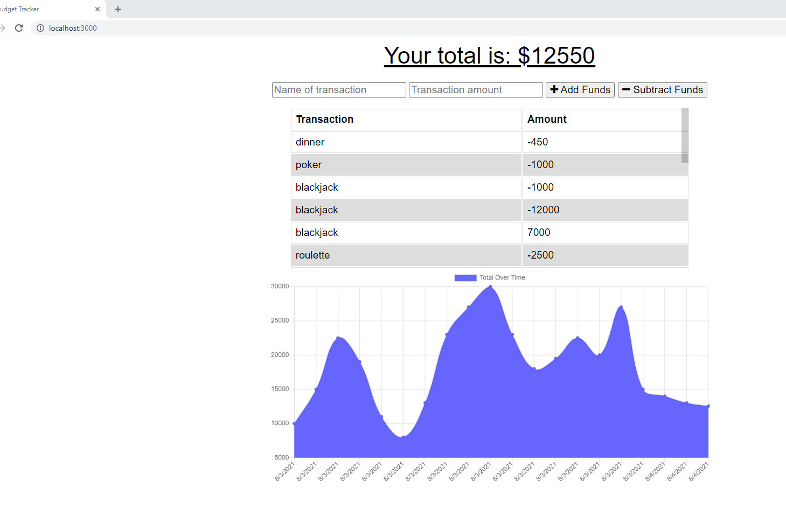

# bond-company-stooge

Budget Tracker app with offline functionality, powered by MongoDB and IndexedDB.

## ABOUT

This application uses a web manifest and a service-worker to cache data in IndexedDB so that the user may utilize the application even when they are offline. The changes the user makes are stored and then automatically added to the database when the user has an internet connection.

### Technologies Used

Express, Mongoose, Node, Compression, MongoDB, JavaScript, HTML, CSS, Chart.JS

### Screenshots and Screencasts

